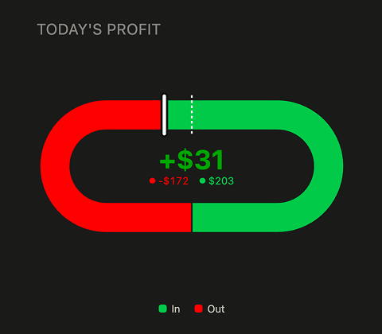

# Track Chart

A chart experiment I created for checking whether two opposing flows are in balance at a glance, without reading a number first. Based on a Pie and gauge chart.

**Live demo:** https://kevinclayland.github.io/Track-Chart/

## The idea

Most dashboards that need to answer "does money in match money out" (or units received vs. shipped, rows read vs. rows written, debits vs. credits) fall back on a variance table or a pass/fail chip. That's a reconciliation check, and it's a real, named category in enterprise BI. Almost nothing gives the person doing the check a *shape*, just a number to read.

Track Chart is a closed, racetrack-shaped loop. Two values — in and out — are drawn as colored arcs from a single fixed starting point. Because the track is left-right symmetric, a perfect 1:1 split lands the boundary exactly opposite the start, with no marker needed to prove it. Any imbalance visibly drags the boundary off-center, toward whichever side is smaller.

The read isn't "what's the exact ratio", it's "does this look lopsided," answered in the time it takes to look at it.

## Why a loop instead of a bar

A 100%-stacked bar with a center tick asks you to find two things — the boundary and the tick — and compare their positions. That's a deliberate, sequential comparison, even though each position on its own is easy to read precisely.

A symmetric shape asks a different question: is this the same on both sides? Human vision has fast, largely pre-attentive machinery for exactly that judgment when it's posed as bilateral symmetry — it's closer to pop-out than to careful reading. Bar charts win when the point is precise magnitude (a bullet graph, a KPI with a hard target). This chart is for a different job: same/different, checked instantly, with severity built into how far off-balance it looks.

That also means the "failure mode" people usually worry about — extreme ratios shrinking one side to a sliver isn't a flaw here. It's the alarm scaling correctly. If out is dwarfing in, it *should* look alarming.

## How it's built

- The loop's starting point is fixed at the bottom-center. The "in" arc is drawn first from that point, "out" completes the loop and closes back on the same point.
- A dashed reference tick always sits at the exact geometric opposite of the start, this is a property of the symmetric shape, not something computed per data point.
- The solid divider tick marks the actual boundary between in and out, and drifts toward the smaller side as the ratio moves away from 1:1.
- A center readout gives the exact delta (details-on-demand) so the shape doesn't have to carry precise magnitude, it only has to carry ratio and direction.
- Colors, theme (light/dark), and the readout all scale down cleanly so the chart can work as a small embedded KPI tile, not just a full-page hero visual.

## Try it

Enter money in / money out, or use the presets (balanced, slight/extreme surplus or deficit, all-in/all-out) to see how the shape responds across the full range, including the edge cases.

## Status

This is a working prototype and a genuine attempt at a new chart type, not just a demo. It holds up under testing across the full ratio range. What's still open:

- **Naming a threshold for "suspicious":** a 98/2 day and a 100/0 day probably shouldn't look identical, since one likely means a feed dropped rather than an unusually good day — that's a labeling decision, not a geometry one.
- **Distribution:** a chart type doesn't become a real tool until people other than its designer read broken numbers with it and it survives contact with a design review. That's the next step, not a solved problem.

## Credit

Designed by [Kevin Clayland](https://kevinclayland.com) — Design Team Lead / Principal Product Designer, 12 years in enterprise BI.
